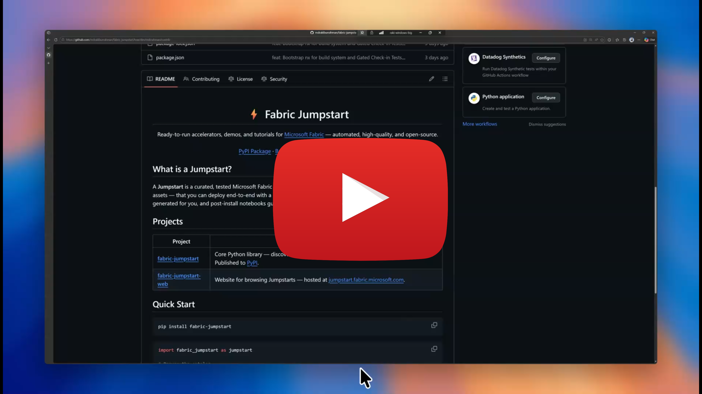

# Contributing

Thank you for helping improve Fabric Jumpstart!

## Development Setup to contribute to all sub-projects (e.g. Python CLI, Website)

### Windows users

[](https://jumpstartfabric.blob.core.windows.net/public/jumpstart-dev-env-setup.mp4)

1. Windows pre-reqs

   ```powershell
   winget install -e --id Microsoft.VisualStudioCode
   ```

2. Get a fresh new WSL machine up:

   > ⚠️ Warning: this removes your WSL machine and recreates it fresh.

   ```powershell
   $GIT_ROOT = git rev-parse --show-toplevel
   & "$GIT_ROOT\contrib\bootstrap-dev-env.ps1"
   ```

3. Clone the repo, and open VSCode in it:

   ```bash
   cd ~/
   
   read -p "Enter your name (e.g. 'FirstName LastName'): " user_name
   read -p "Enter your github email (e.g. 'your-github-alias@blah.com'): " user_email
   read -p "Enter the branch to switch to: (e.g. 'main') " branch_name
    
   git clone https://github.com/microsoft/fabric-jumpstart.git
   
   git config --global user.name "$user_name"
   git config --global user.email "$user_email"
   
   cd fabric-jumpstart/

   git pull origin
   git switch "$branch_name"
   code .
   ```

   At this point, ensure you're in the WSL:

   

4. Run the bootstrapper script, that installs all tools idempotently:

   ```bash
   GIT_ROOT=$(git rev-parse --show-toplevel)
   chmod +x ${GIT_ROOT}/contrib/bootstrap-dev-env.sh && ${GIT_ROOT}/contrib/bootstrap-dev-env.sh
   ```

> Note: if an `Error loading webview: Error: Could not register service worker` error occurs while trying to view Markdown or Notebook files, restart all VS Code windows.

## Running the GCI Targets Locally

After bootstrapping, run the same checks that CI runs:

```bash
npx nx run-many -t build --output-style=stream
npx nx run-many -t test --output-style=stream
```

### Linux users

The steps above, minus WSL should work as-is.