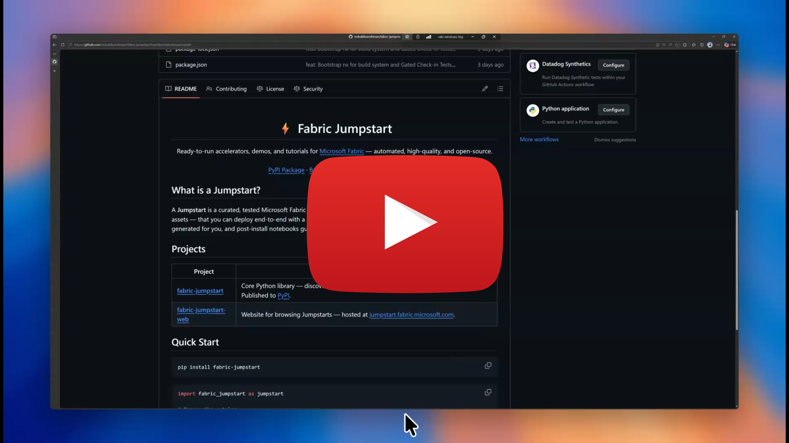

# Contributing

Thank you for helping improve Fabric Jumpstart!

## Development Setup to contribute to all sub-projects (e.g. Python CLI, Website)

### Windows users

[](https://jumpstartfabric.blob.core.windows.net/public/jumpstart-dev-env-setup.mp4)

1. Windows pre-reqs

   ```powershell
   winget install -e --id Microsoft.VisualStudioCode
   ```

2. Get a fresh new WSL machine up:

   > ⚠️ Warning: this removes your WSL machine and recreates it fresh.

   ```powershell
   $GIT_ROOT = git rev-parse --show-toplevel
   & "$GIT_ROOT\contrib\bootstrap-dev-env.ps1"
   ```

3. Clone the repo, and open VSCode in it:

   ```bash
   cd ~/
   
   read -p "Enter your name (e.g. 'FirstName LastName'): " user_name
   read -p "Enter your github email (e.g. 'your-github-alias@blah.com'): " user_email
   read -p "Enter the branch to switch to: (e.g. 'main') " branch_name
    
   git clone https://github.com/microsoft/fabric-jumpstart.git
   
   git config --global user.name "$user_name"
   git config --global user.email "$user_email"
   
   cd fabric-jumpstart/

   git pull origin
   git switch "$branch_name"
   code .
   ```

   At this point, ensure you're in the WSL:

   

4. Run the bootstrapper script, that installs all tools idempotently:

   ```bash
   GIT_ROOT=$(git rev-parse --show-toplevel)
   chmod +x ${GIT_ROOT}/contrib/bootstrap-dev-env.sh && ${GIT_ROOT}/contrib/bootstrap-dev-env.sh
   ```

> Note: if an `Error loading webview: Error: Could not register service worker` error occurs while trying to view Markdown or Notebook files, restart all VS Code windows.

## Reopening an Existing Dev Environment

If WSL is closed (e.g. after a reboot), you don't need to re-bootstrap. Just reopen WSL and your workspace:

1. Open a WSL terminal from PowerShell:

   ```powershell
   wsl
   ```

2. Navigate to the repo and open VS Code:

   ```bash
   cd ~/fabric-jumpstart
   code .
   ```

3. Load nvm (if node/npm aren't found):

   ```bash
   export NVM_DIR="$HOME/.nvm"
   [ -s "$NVM_DIR/nvm.sh" ] && . "$NVM_DIR/nvm.sh"
   ```

   > Tip: This is already in your `.bashrc` if you used the bootstrap script, but new terminals may need it if the shell profile didn't load.

## Running the GCI Targets Locally

After bootstrapping, run the same checks that CI runs:

```bash
npx nx run-many -t build --output-style=stream
npx nx run-many -t test --output-style=stream
```

## Running the Website Dev Server

Start (or restart) the Next.js dev server on port 8080:

```bash
./src/fabric_jumpstart_web/start-dev-server.sh
```

The script idempotently kills any existing server on the port, cleans the `.next` cache, and starts fresh. Pass a custom port as an argument if needed:

```bash
./src/fabric_jumpstart_web/start-dev-server.sh 3000
```

### Linux users

The steps above, minus WSL should work as-is.

## Regenerating Mermaid Diagrams

Mermaid diagrams are pre-rendered as static SVGs (light and dark variants) and committed to `assets/images/diagrams/`. There are two ways to generate them:

> **Important:** CI does not generate diagrams — it only copies committed SVGs from `assets/images/diagrams/` to `public/` during the build. Missing SVGs will result in broken images on the website.

### Option 1: Batch Render Script (recommended)

To regenerate all diagrams at once (requires Puppeteer/Chrome):

```bash
npm run render-diagrams
```

This reads the `mermaid_diagram` field from every jumpstart YAML and writes SVGs to `assets/images/diagrams/`.

### Option 2: Diagram Generator Page

Use the built-in web page — no extra dependencies required:

1. Start the dev server: `./src/fabric_jumpstart_web/start-dev-server.sh`
2. Go to [`https://jumpstart.fabric.microsoft.com/tools/diagram-generator`](https://jumpstart.fabric.microsoft.com/tools/diagram-generator)
3. Paste the Mermaid syntax from the jumpstart's `mermaid_diagram` YAML field
4. Enter the jumpstart's `logical_id` so that the files are downloaded with the right name
5. Click **Download Light + Dark SVGs**
6. Place both files in `assets/images/diagrams/` and commit them

