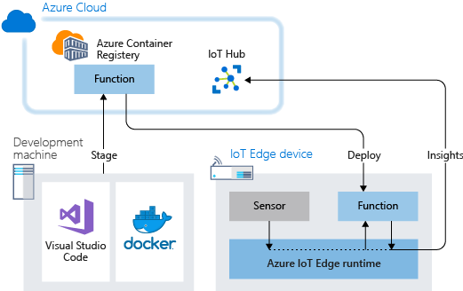
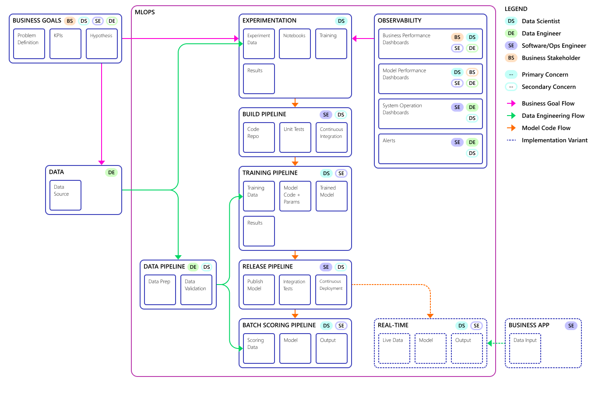
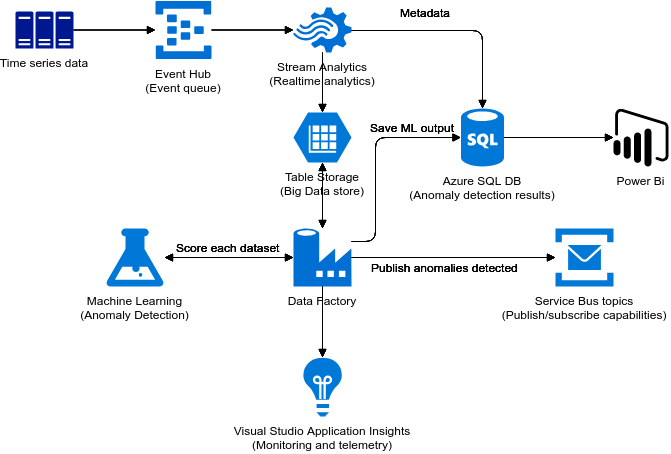
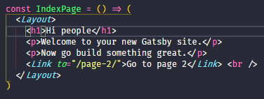

This jumpstart deploys a comprehensive activity events monitoring solution into your Microsoft Fabric workspace. It captures, processes, and visualizes platform activity events for operational insights.

## Getting Started

1. [Microsoft Fabric Documentation](https://learn.microsoft.com/en-us/fabric/) — official documentation for the platform.

This is a hyperlink: [Fabric Jumpstart GitHub](https://github.com/microsoft/fabric-jumpstart).

Bold text: **Activity Events** and also italic text: _real-time monitoring pipeline_.

Strikethrough: ~~deprecated manual approach~~

<Callout>

💡 Heads up — this jumpstart requires a Fabric capacity with at least F2 SKU!

🧾 You can learn more about [capacity planning](https://learn.microsoft.com/en-us/fabric/enterprise/licenses) in the docs.

🚀 Once deployed, the monitoring pipeline starts automatically!

</Callout>

## Architecture Overview

### Pipeline Components

And an ordered list:

1. First, the Event Hub ingests activity events from Fabric
2. A Spark Structured Streaming notebook processes events in real-time
3. We store results in a `Lakehouse` Delta table and **visualize** in Power BI!

<Callout>

❗ Make sure your Event Hub namespace has the correct RBAC permissions configured!

</Callout>

Inline-style logo:


## Code Examples

```python
from pyspark.sql import SparkSession

spark = SparkSession \
  .builder \
  .appName("ActivityEventsMonitor") \
  .config("spark.sql.extensions", "io.delta.sql.DeltaSparkSessionExtension") \
  .config("spark.sql.catalog.spark_catalog", "org.apache.spark.sql.delta.catalog.DeltaCatalog") \
  .getOrCreate()
```

```scala
import org.apache.spark.sql.SparkSession

val spark = SparkSession
  .builder()
  .appName("ActivityEventsMonitor")
  .config("spark.sql.extensions", "io.delta.sql.DeltaSparkSessionExtension")
  .config("spark.sql.catalog.spark_catalog", "org.apache.spark.sql.delta.catalog.DeltaCatalog")
  .getOrCreate()
```

```javascript
var s = "JavaScript syntax highlighting"
alert(s)
```

```python
s = "Python syntax highlighting"
print(s)
```

```sql
SELECT * FROM activity_events
WHERE event_type = 'ExecutionStart'
ORDER BY timestamp DESC
```

```csharp
static async Task Main()
{
    var builder = new HostBuilder();
#if DEBUG
    builder.UseEnvironment("development");
#endif
    builder.ConfigureWebJobs(b =>
    {
        b.AddAzureStorageCoreServices();
        b.AddAzureStorage();
    });
    var host = builder.Build();
    using (host)
    {
        await host.RunAsync();
    }
}
```

```css
/* Custom dashboard styles */
:root {
  --color-bg-primary: #ffffff;
  --color-bg-secondary: #edf2f7;
  --color-text-primary: #2d3748;
  --color-text-accent: #2b6cb0;
}
```

```json
{
  "eventType": "ExecutionStart",
  "workspaceId": "abc-123",
  "itemName": "MonitoringNotebook",
  "timestamp": "2025-01-15T10:30:00Z"
}
```

<Callout>☝ Remember to configure your connection strings before running the notebooks!</Callout>

## Data Schema

Colons can be used to align columns.

| Column        | Type          | Description                |
| ------------- | ------------- | -------------------------- |
| `event_id`    | `STRING`      | Unique event identifier    |
| _timestamp_   | ~~DATETIME~~ `TIMESTAMP` | **Event time** |
| `event_type`  | `STRING`      | Type of activity event     |
| `workspace`   | `STRING`      | Source workspace name      |

Three or more...

---

Hyphens

---

Asterisks

---

Underscores

All generate horizontal lines.

## Video Walkthrough

We can embed a YouTube video to demonstrate the solution:

<YouTubeEmbed url="https://www.youtube.com/embed/KXkBZCe699A" />

## Architecture Diagrams

Images — we keep them in the `images/` subfolder:



The reason this picture is small is because the resolution is only `521 x 328`.

Here's a bigger one that fills the width:



Noting that transparent backgrounds work well with both themes:



## Animated Demos

GIFs stored locally alongside images:



But we can always link from online too:


## Advanced Configuration

<QuoteBlock author="Fabric Engineering Team" source="Best Practices Guide">
Always use Delta format for your monitoring tables to benefit from ACID transactions and time travel capabilities.
</QuoteBlock>

### Unordered List Features

- Real-time event ingestion
- Automatic schema evolution
- Built-in data quality checks
- **Power BI** dashboard with drill-through
- Support for `custom event types`

### Nested Content

> This is a standard blockquote showing how the monitoring pipeline processes events in near real-time with sub-second latency.

<Callout>

🎉 Congratulations! You've explored all the MDX features available in Fabric Jumpstart scenario documentation.

</Callout>
