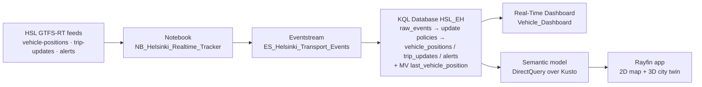
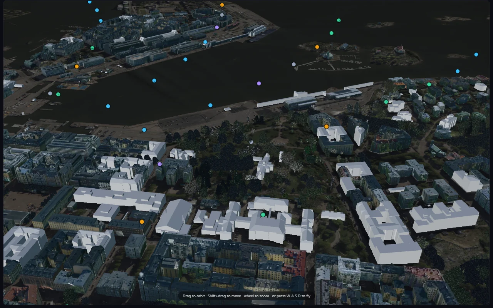

This jumpstart deploys an **end-to-end Real-Time Intelligence stack** into your Microsoft Fabric workspace: a notebook that polls the public [HSL GTFS-RT feeds](https://hsldevcom.github.io/gtfs_rt/) for the whole Helsinki region, an Eventstream that carries the events, an Eventhouse that shapes them with update policies into typed tables, a DirectQuery semantic model, and a Real-Time Dashboard — every bus, tram, train and ferry in the city, moving on a map, seconds after it actually moved.

<Callout>

👤 **Authored by Kevin Thomas.** The original Helsinki real-time transit solution, its Real-Time Intelligence architecture and the Fabric portal host-bridge data path are his. Packaged as a jumpstart by Alexander Korn, who added a token-free photoreal 3D city twin.

</Callout>

⏱️ **Deploy time: ~3 minutes.** Plan another ~10 minutes to let the first events land, open the dashboard, and — optionally — install the matching map app.

No API key, no registration, no sample data: the HSL feed is public and live.

## What Gets Deployed

| Item | Type | Role |
|------|------|------|
| `NB_Helsinki_Realtime_Tracker` | Notebook | The producer. Polls the HSL GTFS-RT `vehicle-positions`, `trip-updates` and `service-alerts` feeds, decodes the protobuf, and posts batches to the Eventstream custom endpoint. Runs on a schedule. |
| `ES_Helsinki_Transport_Events` | Eventstream | Custom-endpoint ingress; routes the raw events into the Eventhouse. |
| `Helsinki_Public_Transport_EH` | Eventhouse | Hosts the KQL database and the streaming ingestion policy. |
| `HSL_EH` | KQL Database | `raw_events` landing table plus **update policies** that fan it out into `vehicle_positions`, `trip_updates` and `alerts`, and a materialized view `last_vehicle_position` that keeps only the newest row per vehicle. |
| `Vehicle_Dashboard` | Real-Time Dashboard | KQL dashboard over the Eventhouse — live fleet map, vehicle counts, route activity. |
| `Helsinki Public Transport` | Semantic Model | **DirectQuery over Kusto**, with the datasource configured for end-user SSO, so every user reads the Eventhouse under their own identity. This is what a client app queries with DAX. |

All items land in a workspace folder named `helsinki-public-transport`.

## How It Works



### Ingestion — one notebook, no connector needed

GTFS-RT is a protobuf feed, not something an Eventstream can read on its own. The notebook decodes it and pushes JSON batches at the custom endpoint — vehicle positions on a fast loop, trip updates on a slower one, because positions change every second and timetable predictions do not.

### Shaping — update policies instead of downstream ETL

Everything lands once in `raw_events`. Three update policies then project each event type into its own typed table the moment it arrives, so there is no pipeline, no orchestration and no second copy of the data to keep in sync. `last_vehicle_position` is a materialized view over `vehicle_positions` — "where is every vehicle *right now*" is one cheap read rather than an `arg_max` over the full history.

### Serving — DirectQuery semantic model

The semantic model sits on the KQL database in DirectQuery, so there is nothing to refresh. Because its Kusto datasource uses end-user SSO, row access follows the signed-in user rather than a service identity.

## The Map App (Optional, Separate Install)

The jumpstart deploys the Fabric back end. The matching front end — a live map that renders the fleet on a 2D Leaflet map **and** on a photoreal 3D city twin — ships separately as a template in the [Awesome Rayfin](https://github.com/microsoft/awesome-rayfin) gallery:

```bash
npm create @microsoft/rayfin -- --template https://github.com/microsoft/awesome-rayfin
# then pick "Helsinki Public Transport" from the template picker
npx rayfin up
```

Point its connector at the semantic model this jumpstart created, deploy, and you get:


Running **inside the Fabric portal**, the app never handles a token: the portal exposes a `postMessage` bridge that executes the DAX server-side as the signed-in user. No second sign-in. Opened standalone, it falls back to MSAL plus the Power BI REST `executeQueries` endpoint.

### A 3D city twin with no keys attached

The 3D mode renders vehicles on the City of Helsinki's own photogrammetric city model — **no Cesium ion token, no Google Maps API key**. Every layer is CC BY 4.0 open data streamed straight from `kartta.hel.fi`, which sends CORS headers, so nothing has to be re-hosted:

| Layer | Source |
|---|---|
| Reality mesh (2017) | 3D Tiles, 42k aerial photos, ~7.5 cm/px |
| Textured semantic LoD2 buildings | CityGML converted to 3D Tiles |
| Park and street trees | 3D Tiles |
| Terrain | quantized-mesh (2021) |
| Base imagery | `Ortoilmakuva_2025_5cm` orthophoto WMS, 5 cm/px |



The photogrammetric mesh already contains the tree canopy — it is baked into the aerial photos — which is why the separate tree models only apply to the CityGML surface:


<Callout>

🗺️ Attribution: *3D models of Helsinki, Helsingin kaupunginkanslia, CC BY 4.0.* Vehicle data: *Helsingin seudun liikenne (HSL), CC BY 4.0.*

</Callout>

## Use Cases

- **Real-Time Intelligence reference** — a complete, honest RTI path (streaming ingress → update policies → materialized view → DirectQuery → dashboard) on a public feed anyone can reproduce.
- **Update-policy pattern** — one landing table fanned out into typed tables at ingest time, instead of a downstream pipeline.
- **End-user SSO on Kusto** — DirectQuery where the query runs as the signed-in user.
- **Fabric App demo** — a worked example of a custom front end reading a semantic model from inside the portal without a second sign-in.
- **Any GTFS-RT city** — the feed format is a standard. Swap the URLs and the same stack tracks another operator.
