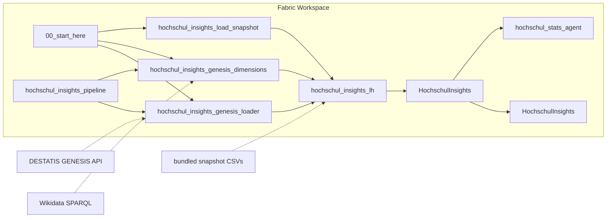
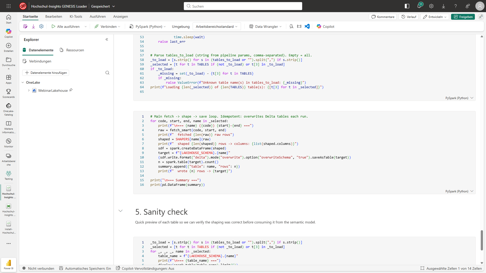
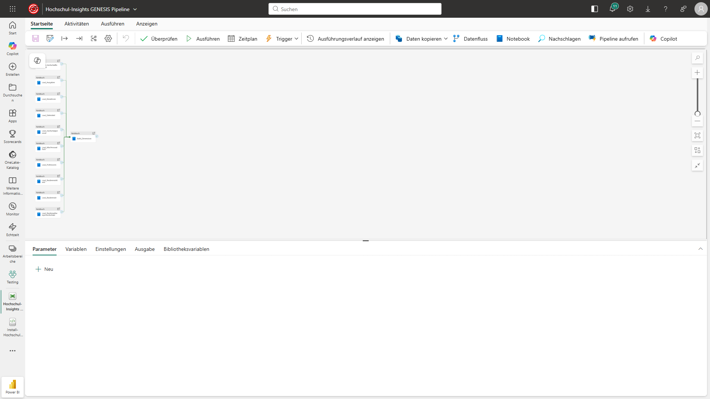
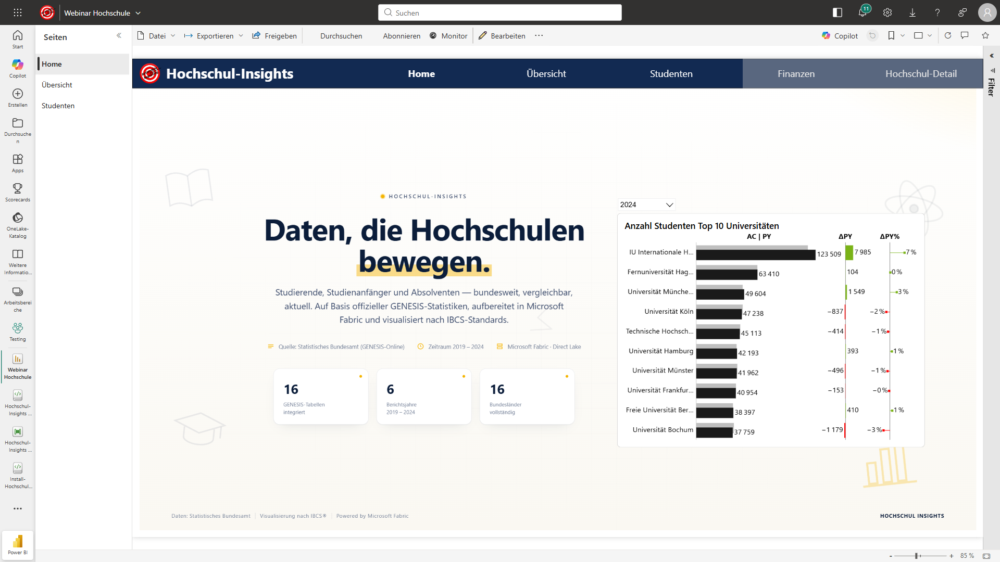
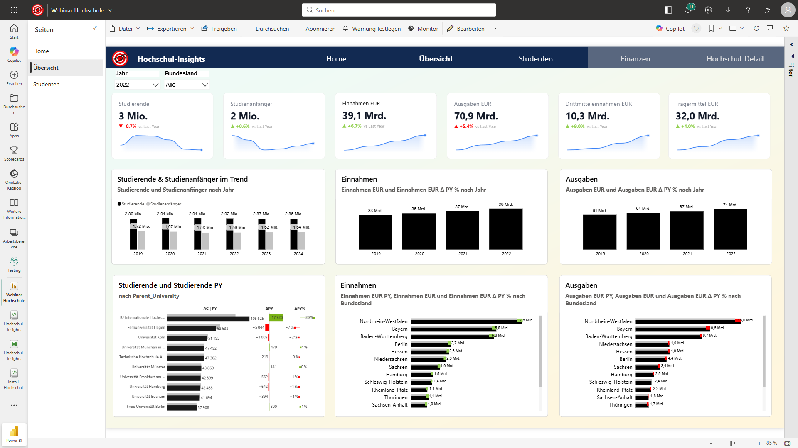
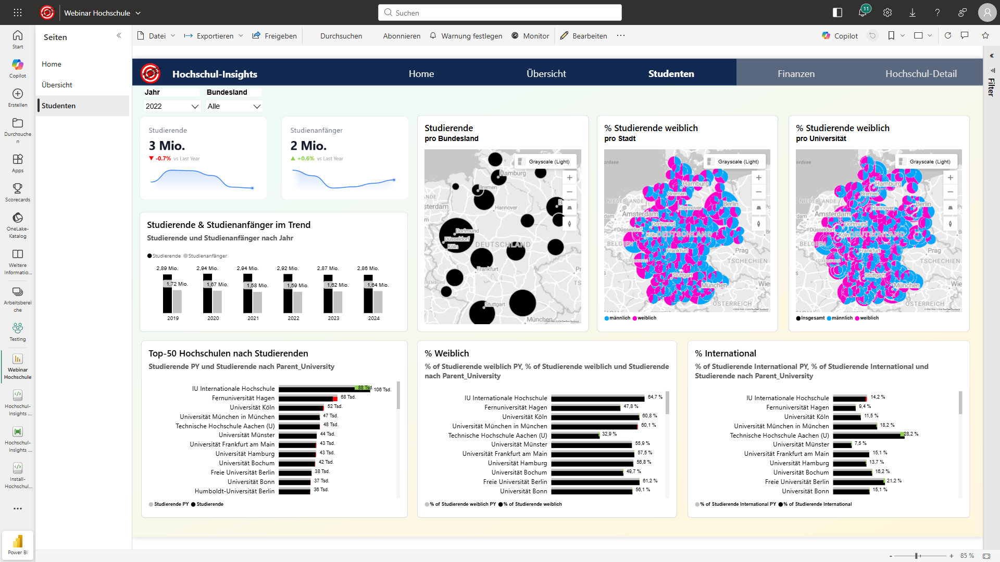

This jumpstart deploys an **end-to-end German higher-education analytics stack** into your Microsoft Fabric workspace — a Lakehouse seeded with 10 fact and 6 dimension tables sourced from the DESTATIS GENESIS-Online API (German Federal Statistical Office) and enriched with Wikidata geo data, a Data Pipeline that orchestrates parallel loads, a Direct Lake semantic model, an 8-page IBCS-styled Power BI report including an Azure Map of all 422 German Hochschulen, and a Data Agent for natural-language Q&A — all installed with one call.

<Callout>

🎓 Vom öffentlichen DESTATIS-Datensatz zum Live-Power-BI-Insight — in unter 5 Minuten. Designed as a DACH EDU / public-sector reference for Direct Lake, IBCS reporting standards, and the Fabric Data Agent on a realistic real-world model.

</Callout>

⏱️ **Deploy time: ~3 minutes** from the bundled snapshot. Plan another ~10 minutes to optionally register a free DESTATIS token, run the pipeline once, and explore the report.

## What Gets Deployed

| Item | Type | Role |
|------|------|------|
| `hochschul_insights_lh` | Lakehouse | Schema-enabled Delta storage (schema `Genesis`) for 10 fact tables and 6 dimensions. Direct Lake source for the semantic model. |
| `00_start_here` | Notebook | Entry point. Explains the architecture, links to the loader / dimensions / snapshot notebooks, and documents how to switch between snapshot mode and live mode. |
| `hochschul_insights_load_snapshot` | Notebook | Loads the bundled snapshot CSVs (`data/snapshot/*.csv` from the source repo) into Delta — the fastest path. No DESTATIS token required. |
| `hochschul_insights_genesis_loader` | Notebook | Live mode. Fetches 10 GENESIS fact tables from the DESTATIS REST API (`https://www-genesis.destatis.de/genesisWS/rest/2020/data/tablefile`), reshapes each into a tidy Spark DataFrame, and writes Delta — idempotent, overwrite-each-run. Requires a free DESTATIS username token. |
| `hochschul_insights_genesis_dimensions` | Notebook | Builds the 6 dimensions, including a `Hochschulen` dimension enriched with Wikidata SPARQL queries for lat/lng and Bundesland mapping for the Azure Map visual. |
| `hochschul_insights_pipeline` | DataPipeline | Runs all 10 fact-table loaders in **parallel**, then triggers the dimensions notebook once the facts are in place. End-to-end refresh in ~5–10 min. |
| `HochschulInsights` | SemanticModel | Direct Lake model on top of `hochschul_insights_lh`. Star schema, IBCS-compliant DAX measures (variance, contribution, prior-year, ranking). No import, no refresh. |
| `HochschulInsights` | Report | 8-page IBCS-styled Power BI report covering Studierende, Personal, Finanzen and Drittmittel — including a geographic visual of all 422 German Hochschulen on Azure Maps. |
| `hochschul_stats_agent` | DataAgent | Natural-language Q&A over the semantic model. Ask questions like *"Welche Universität hatte 2023 die meisten Drittmittel?"* and get a grounded answer. |

All items land in a workspace folder named `hochschul-insights`.

## Architecture

## How It Works

### Snapshot mode (default — no token)

`hochschul_insights_load_snapshot` reads the bundled CSV snapshot shipped in the source repo (`data/snapshot/*.csv`) and writes one Delta table per CSV into the `Genesis` schema. This makes the entire stack — semantic model, report, Data Agent — usable within ~3 minutes without registering anywhere. The snapshot is a point-in-time copy of the same GENESIS tables the live loader fetches.

### Live mode — DESTATIS GENESIS REST API

`hochschul_insights_genesis_loader` fetches each fact table directly from `https://www-genesis.destatis.de/`, reshapes it into a tidy Spark DataFrame, and overwrites the corresponding Delta table. The loader is idempotent — re-running it always produces the same result for a given DESTATIS publication date.

### Dimensions + Wikidata enrichment

`hochschul_insights_genesis_dimensions` builds 6 dimensions: **Bundesland, Hochschulart, Fächergruppe, Geschlecht, Nationalität**, and **Hochschulen**. The `Hochschulen` dimension is enriched by a Wikidata SPARQL query that returns lat/lng coordinates and Bundesland metadata for all 422 German Hochschulen — used directly by the Azure Maps visual in the report.

### Orchestration — pipeline with parallel facts

`hochschul_insights_pipeline` runs all 10 fact-table loader invocations in **parallel**, then triggers the dimensions notebook once the facts have landed. End-to-end refresh takes ~5–10 minutes on an F2 capacity.

### Modeling — Direct Lake, IBCS measures

The `HochschulInsights` semantic model is **Direct Lake** on top of `hochschul_insights_lh` — no import, no refresh, no PBIX. A star schema with 10 fact tables joined to the 6 dimensions, plus a DAX measure layer following the IBCS Notation Standard: absolute values, **AC** (actual), **PY** (prior year), **ΔPY%** (variance to prior year), contribution percentages, and rank measures.

### Report — 8 pages, IBCS, Azure Map

The deployed `HochschulInsights` report is an 8-page IBCS-styled walkthrough of German higher-education statistics:

**Home — landing page with KPIs and a Top-10 university ranking**

**Übersicht — KPI cards plus IBCS comparison charts for Studierende, Einnahmen, Ausgaben across Bundesländer**

**Studenten — Studierende split by gender, city, and university, including the Azure Maps geo visual**

The remaining five pages drill into Personal, Professoren, Finanzen, Drittmittel and a glossary.

### Data Agent — natural-language Q&A

`hochschul_stats_agent` is wired against the semantic model. Sample questions:

- *Welche Hochschule hatte 2023 die meisten Drittmittel?*
- *Show me the share of female students per Bundesland for the last 5 years.*
- *Top 5 universities by Professorenanzahl in NRW.*

## Data Scope

10 fact tables + 6 dimension tables sourced from DESTATIS GENESIS-Online:

- **Studierende & Studienanfänger** — `21311-0001`, `21311-0002`, `21311-0011`
- **Hochschulpersonal & Professoren** — `21341-0001`, `21341-0002`, `21341-0003`
- **Finanzen** — Hochschulfinanzen, Ausgaben, Einnahmen, Drittmittel — `21371-0010..0013`
- **Dimensions** — Bundesland, Hochschulart, Fächergruppe, Geschlecht, Nationalität + **Hochschulen** (Wikidata-enriched)

## Going Live

<Callout>

⚙️ Snapshot mode is the default and requires **no token**. Live mode only kicks in if you supply a DESTATIS GENESIS username token to `hochschul_insights_genesis_loader`.

</Callout>

To run the loader against the live DESTATIS API:

1. Register at <a href="https://www-genesis.destatis.de/genesis/online" target="_blank" rel="noopener noreferrer">https://www-genesis.destatis.de/genesis/online</a> (free).
2. Copy your **username** token from your profile page. The free tier is sufficient — the loader only uses synchronous calls.
3. Paste the token into the parameter cell of `hochschul_insights_genesis_loader` (or, recommended for production, store it in Azure Key Vault and read it via `notebookutils.credentials.getSecret()`).
4. Run `hochschul_insights_pipeline` — it executes all 10 fact loaders in parallel, then the dimensions notebook.

DESTATIS publishes updates monthly at most, so a weekly schedule is more than enough.

**License**: DESTATIS data is published under <a href="https://www.govdata.de/dl-de/by-2-0" target="_blank" rel="noopener noreferrer">Datenlizenz Deutschland 2.0</a> — commercial use is permitted with attribution.

## Use Cases

- **DACH presales demo** — a realistic German-language reference customers can relate to (Bundesländer, Hochschularten, EUR / Mio. EUR formatting).
- **Direct Lake reference** — fully functional Direct Lake stack on real-world dimensions.
- **IBCS reference** — IBCS-compliant DAX measure layer and report design (AC/PY/ΔPY%, contribution, ranking).
- **Fabric Data Agent reference** — natural-language Q&A grounded in a real domain model.
- **Public-sector data showcase** — pattern works for any government Open Data REST API (DESTATIS, Eurostat, OECD, World Bank).
