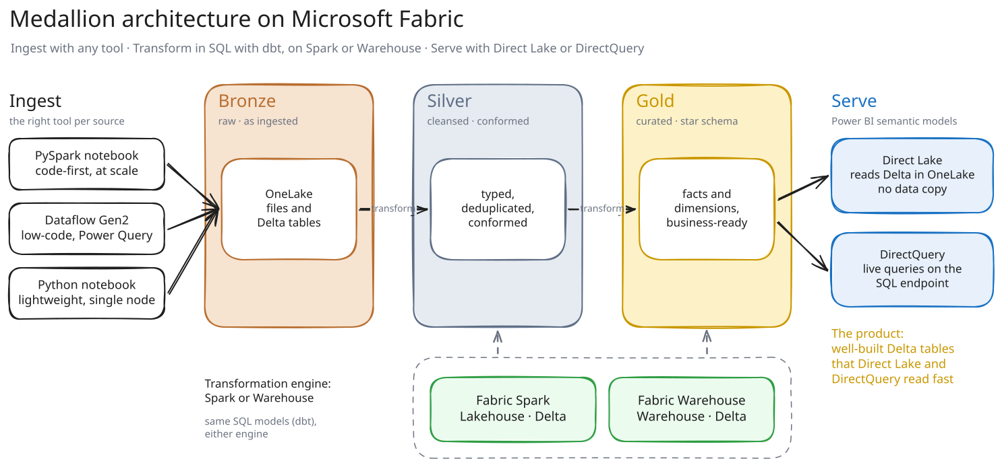

One dbt project builds the same gold layer of Australian electricity-market data (AEMO) on
**Fabric Warehouse** and on **Fabric Spark**. It uses Microsoft's two dbt adapters,
`dbt-fabric` and `dbt-fabricspark`. At the end of every run, the pipeline checks that the two
engines produced the same numbers.

## What gets deployed

| Item | Type | Role |
|------|------|------|
| `run_pipeline` | DataPipeline | Entry point: `ingest`, then `run` once per engine in parallel, then `parity`. |
| `ingest` | Notebook | Downloads the public AEMO files into `dbt_landing`. |
| `run` | Notebook | Installs dbt and one engine's adapter, then runs `dbt build`. |
| `parity` | Notebook | Fails the run if the two engines' gold tables disagree. |
| `dbt_landing` | Lakehouse | The landing zone: raw CSVs, read by both engines. |
| `dbt_dwh` | Warehouse | The Warehouse engine's tables. |
| `dbt` | Lakehouse | The Spark engine's tables. |
| `aemo_dwh`, `aemo_spark` | SemanticModel | A Direct Lake model on each engine's gold tables. |
| `deploy_config` | VariableLibrary | The run's settings. |

All items land in a workspace folder named `medallion-dbt`.

## Run it

1. Open `run_pipeline` and click **Run**. Nothing runs until you do.
2. When it finishes, open `aemo_dwh` or `aemo_spark` and build a report on it.

Each run downloads a capped number of files, newest first, so the first run gives you
recent data and each later run adds more history. Schedule `run_pipeline` to keep it current.

## Settings

The settings are in `deploy_config`:

| Variable | Default | What it does |
|---|---|---|
| `engines` | `all` | `all`, `dwh` or `spark`: which engines to build (parity needs `all`) |
| `daily_download_limit` | `60` | how many daily archive files `ingest` downloads per run |
| `download_limit` | `6` | how many intraday files per feed `ingest` downloads per run |
| `process_limit` | `1000` | how many landed files each fact model processes per run |

## What it builds

There are eight dbt models:
- a staging log of the landed files
- a calendar dimension and a generator (DUID) dimension
- the wide price and generation (SCADA) facts, for history and for today
- `fct_summary`, the small table the semantic models read

The business logic is the same on both engines. Where the dialects differ, each engine has its
own copy of the SQL, and the difference is commented at that line.

Source, docs and a production deploy from CI:
[github.com/djouallah/fabric-medallion-dbt](https://github.com/djouallah/fabric-medallion-dbt).
