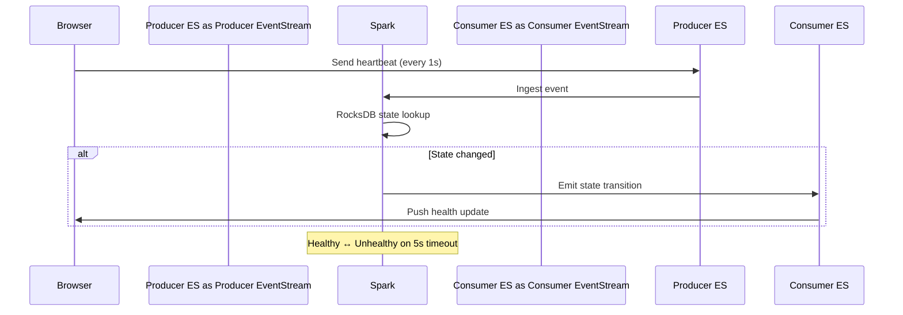
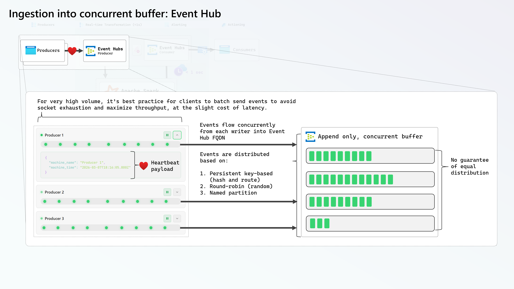

This jumpstart deploys a stateful stream processing demo using Spark Structured Streaming with RocksDB hosted on OneLake into your Microsoft Fabric workspace.

<Callout>

⚡ You're about to experience the full power of Spark Streaming with sub second (<1 second) latency right in your browser.

</Callout>

## Getting Started

After installing the jumpstart, visit the [companion website](https://heartbeatspark.z9.web.core.windows.net) to create heartbeat producers and consumers right in your browser.

## Architecture

## How It Works

- **Producers** on the website send heartbeat events every second
- **Spark** groups events by `machine_name` and tracks state transitions using RocksDB
- State machine: `None → Initializing → Healthy ↔ Unhealthy (on 5s timeout)`
- Only emits output when state **changes**, **not** on every heartbeat, this allows us to effectively treat RocksDB as a distributed buffer so we get notified on interesting events at low-latency.
- **Pause** a producer to watch it go Unhealthy after 5 seconds

### Browser Producer Client to Event Hub

### Spark parallelized MicroBatch Ingestion from Event Hub

### Spark Stateful Processing with RocksDB

## Resources

- [Spark Structured Streaming Programming guide](https://spark.apache.org/docs/latest/streaming/index.html)
- [Spark Stateful Streaming](https://spark.apache.org/docs/latest/streaming/structured-streaming-transform-with-state.html)
- [Event Hub partitioning concepts](https://learn.microsoft.com/en-us/azure/event-hubs/event-hubs-features)
- [Event Hub performance tunables](https://github.com/Azure/azure-event-hubs-spark/blob/a1d92a93dcfdf5b68a46169c6c43750df3231afc/docs/structured-streaming-eventhubs-integration.md#eventhubsconf)